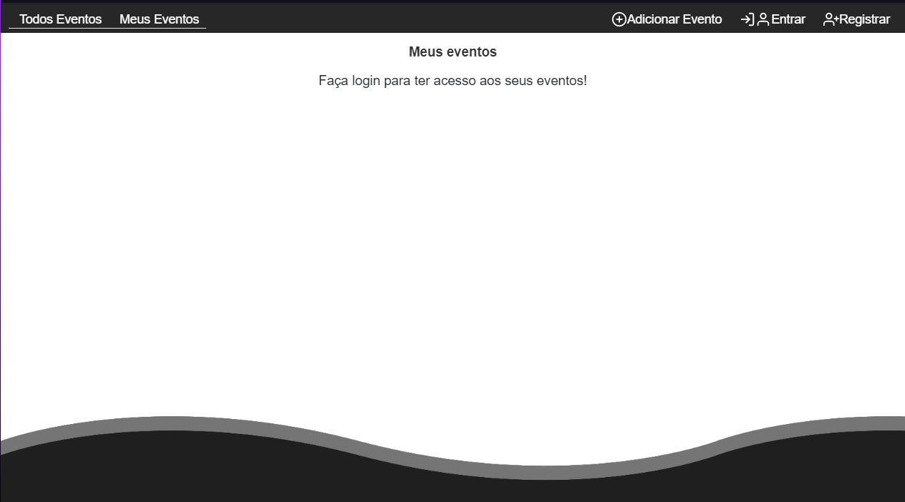

# Agenda de Eventos - Desafio

O sistema tem a funcionalidade de um calendário de eventos, porém, você pode decidir se seu evento será público, aberto para todos verem ou privado, apenas para sua própria ordenação.
Utilizei <a style="color:#0ff">React.Js</a> para a criação do Front-End, já para o Backend utilizei <a style="color:#0ff">Node.Js</a>, e o micro framework <a style="color:#0ff">Express</a>.
Banco de dados utilizado: Postgresql.

-------------------------------------------
## Usage
```
Antes de tudo, de um GIT Clone neste diretório.
```

```
Para instalar todas dependências:

$ npm i 
```
```
Logo após crie um database no Postgre, chamado eventsdb.

Em seguida rode as migrations do knex:

$ npx knex migrate:latest
```

```
Rode os testes no backend: 

$ npm test
```
```
Tudo passou? Agora é só rodar o servidor e o frontend, ambos com o comando:

$ npm start
```

----------------------------------------
## Features
- Registro de usuário e Login autenticado por JWT.
- Listagem (GET), Criação (POST), Atualização (PUT) e Remoção (DELETE) de eventos.
- Eventos Públicos ou Privados. 
- Não sobrecreve eventos, e avisa ao usuário que já existe um evento daquele.
- Ambos backend e FrontEnd estão no padrão REST.
- Responsivo (Utilizado Bootstrap para esse fim).
- Eventos ligado a seus autores.

-------------------------------------

